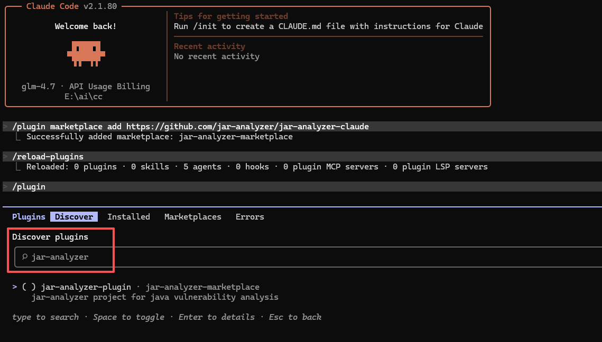
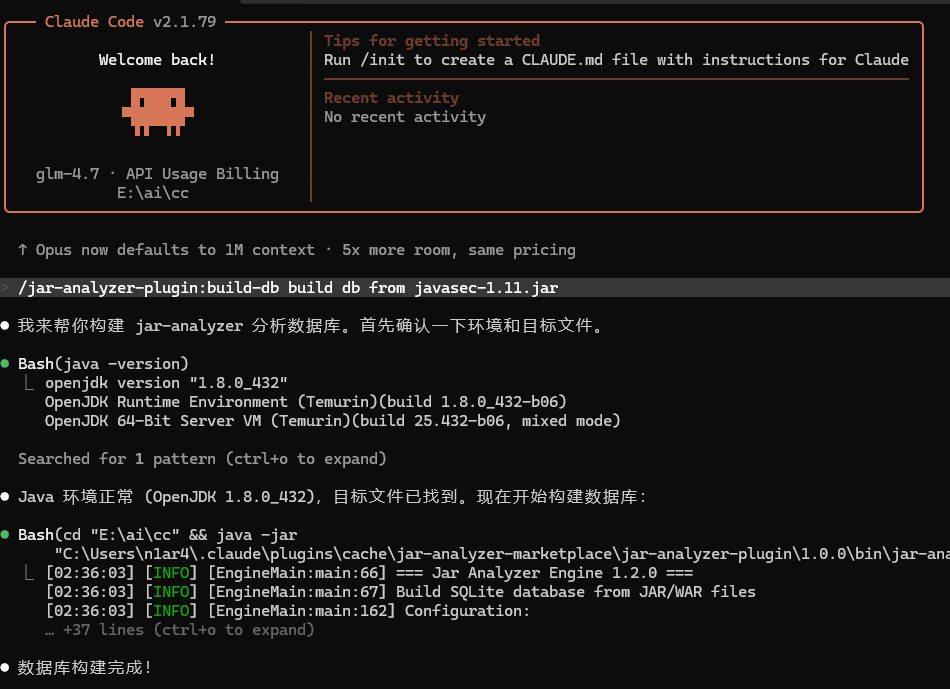
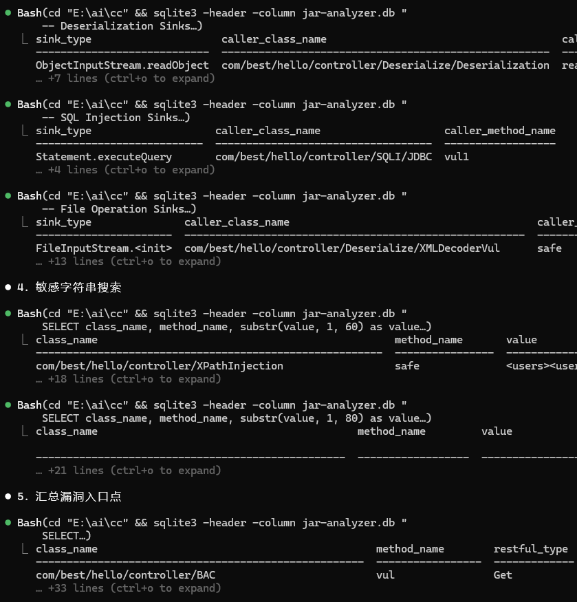
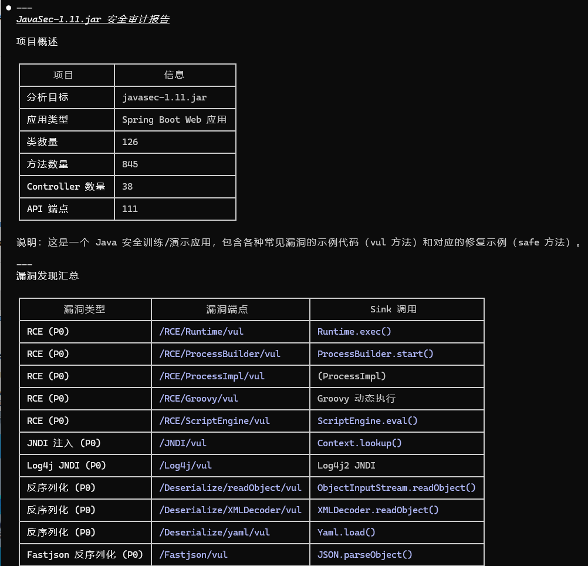

# jar-analyzer-claude

> 基于 [jar-analyzer](https://github.com/jar-analyzer/jar-analyzer) 的 Claude Code 插件，用于 Java JAR/WAR 包**静态分析与安全审计**。

## ✨ 功能特性

- 🗄️ **构建分析数据库** — 从 JAR/WAR/Class 文件构建 SQLite 数据库，提取类信息、方法调用关系、继承关系等
- 🔍 **安全审计分析** — 检测 RCE、SQL 注入、SSRF、反序列化等常见漏洞模式
- 🔗 **方法调用链追踪** — 从危险 sink 回溯到 HTTP 入口，验证漏洞可达性
- 📝 **反编译验证** — 内置 FernFlower 反编译器，快速查看可疑代码
- 🌱 **Spring 组件分析** — 自动识别 Controller、Mapping、拦截器等组件
- 🔑 **敏感信息检测** — 搜索硬编码密码、密钥、JNDI 地址等

## 📦 安装

一行命令添加插件市场：

```shell
/plugin marketplace add https://github.com/jar-analyzer/jar-analyzer-claude
```

添加完成后，在插件市场中选择 **`jar-analyzer-plugin`** 进行安装。

> ⚠️ 插件内置了打包好的 `jar-analyzer-engine`，文件较大，下载可能需要一些时间，请耐心等待。



## 🚀 使用方法

### 第一步：构建数据库

使用 `/build-db` 命令，指定需要审计分析的 JAR/WAR 文件，构建分析数据库。

> 💡 **建议在空目录中执行**，分析完成后当前目录下会生成 `jar-analyzer-temp` 临时目录和 `jar-analyzer.db` 数据库文件。



### 第二步：执行安全分析

使用 `/do-analyze` 命令，对数据库执行安全审计查询（优先使用 `sqlite3` 命令，其次回退到 `python` 脚本）。



### 第三步：查看审计报告

分析完成后，自动生成详细的安全审计报告，坐等结果即可。



## 🛠️ 环境要求

| 依赖 | 版本 | 用途 |
|:-----|:-----|:-----|
| Java | 8+ | 运行分析引擎和反编译 |
| Python | 3+（可选） | 执行 SQL 查询脚本（作为 `sqlite3` 的备选方案） |

## 🙏 致谢

- [jar-analyzer](https://github.com/jar-analyzer/jar-analyzer) — 4ra1n

